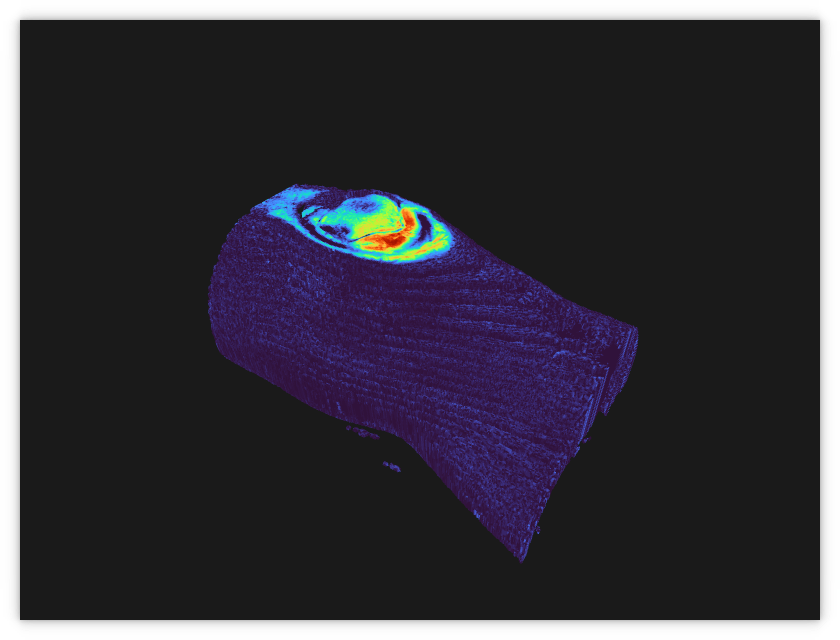
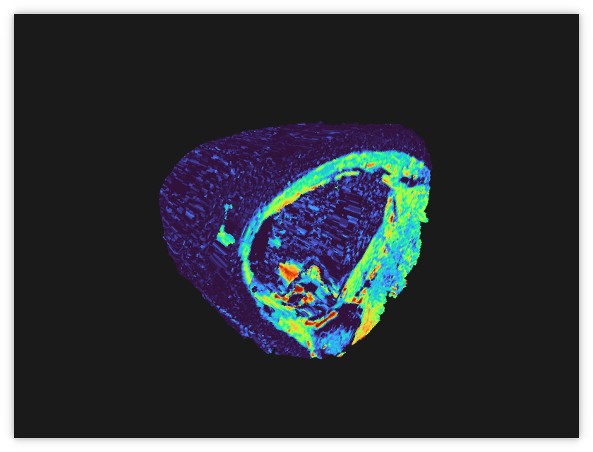
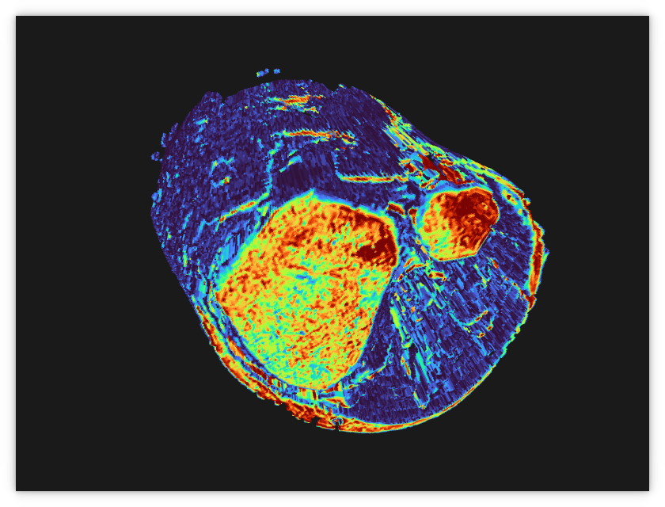
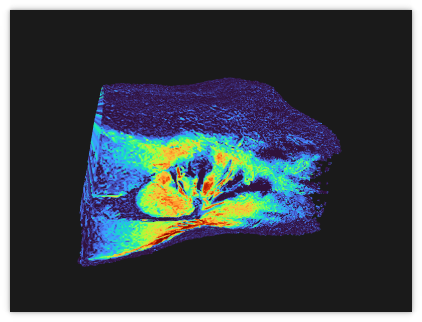
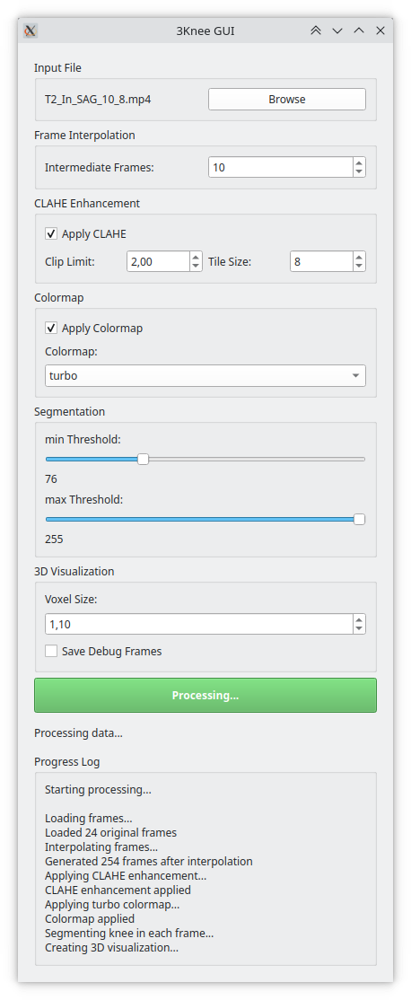

# ThreeKnee 🦵🎥

When I teared my ACL I got low-res MRI videos from the hospital and thought it would be cool to explore the data in 3D. So, I created this toy-tool that takes the frames from those videos, interpolates additional frames to enhance the data, segments the leg and builds a 3D voxel volume you can freely explore.

The major dependencies are

- **Open3D**: For 3D visualization.
- **OpenCV**: For image processing.
- **PyQt5**: For the GUI.

There’s plenty of room for optimization, but this was just a quick, fun project with some vibe coding.

<table> <tr> <td></td> <td></td> </tr> <tr> <td></td> <td></td> </tr> </table> 
---

## 🛠️ Installation

1. Clone the repo:
   ```bash
   git clone https://github.com/yourusername/threeknee.git
   cd threeknee
   ```

2. Set up a virtual environment:
   ```bash
   python3 -m venv venv
   source venv/bin/activate
   ```

3. Install dependencies:
   ```bash
   pip install -r requirements.txt
   ```

4. Run the app:
   ```bash
   python main.py
   ```

---

## 🖥️ How to Use

1. Launch the app with `python main.py`.
2. Use the **Browse** button to select an MP4 file containing MRI data.
3. Adjust **frame interpolation** to generate smoother transitions if your videos doesn't have too many frames.
4. Enable **CLAHE** for contrast enhancement and tweak its parameters.
5. Choose a **colormap** if you want a multicolor knee 🌈
6. You can try to tune the **segmentation thresholds** to isolate the knee region.
7. Configure **voxel size** for 3D visualization.
4. Click **Process and Visualize** to start the magic!
5. Wait a few seconds and enjoy the 3D visualization.

<p align="center">  </p>
---

## 📂 Project Structure

```
threeknee/
├── main.py               # Entry point for the application
├── threekneegui.py       # GUI implementation using PyQt5
├── threekneecore.py      # Core processing logic (frame interpolation, CLAHE, segmentation, etc.)
├── requirements.txt      # List of dependencies
├── debug_frames/         # Debug output (generated during processing)
├── assets/               # Some example images
```
